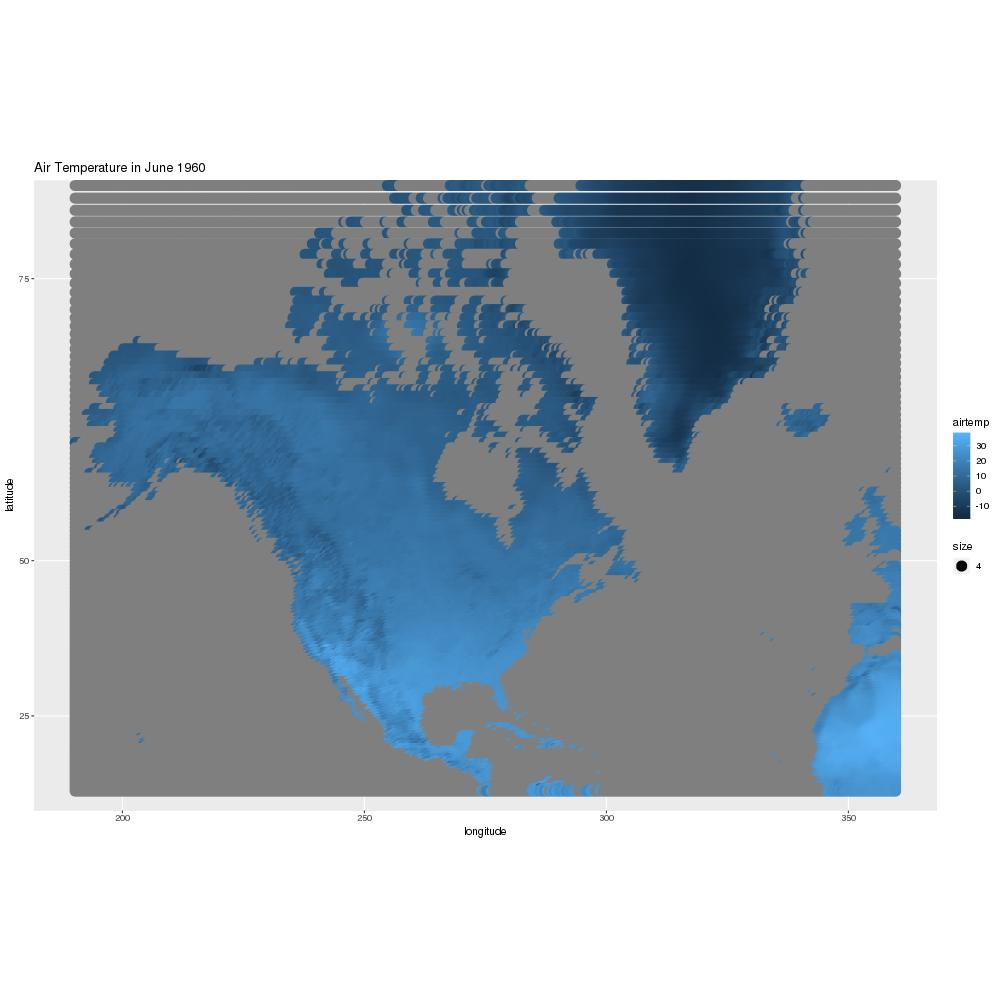
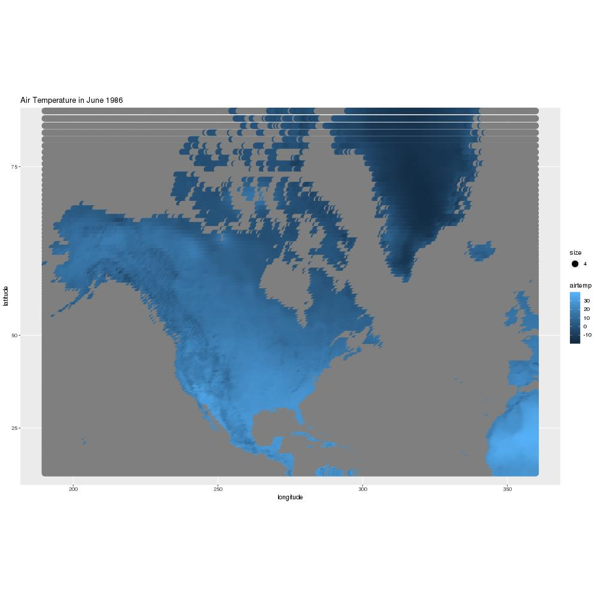
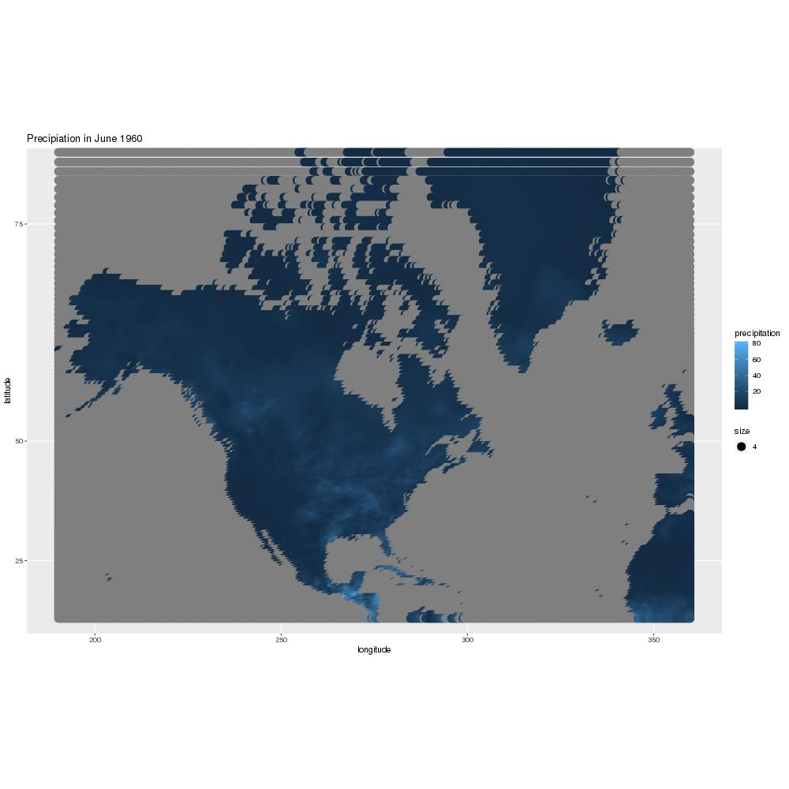
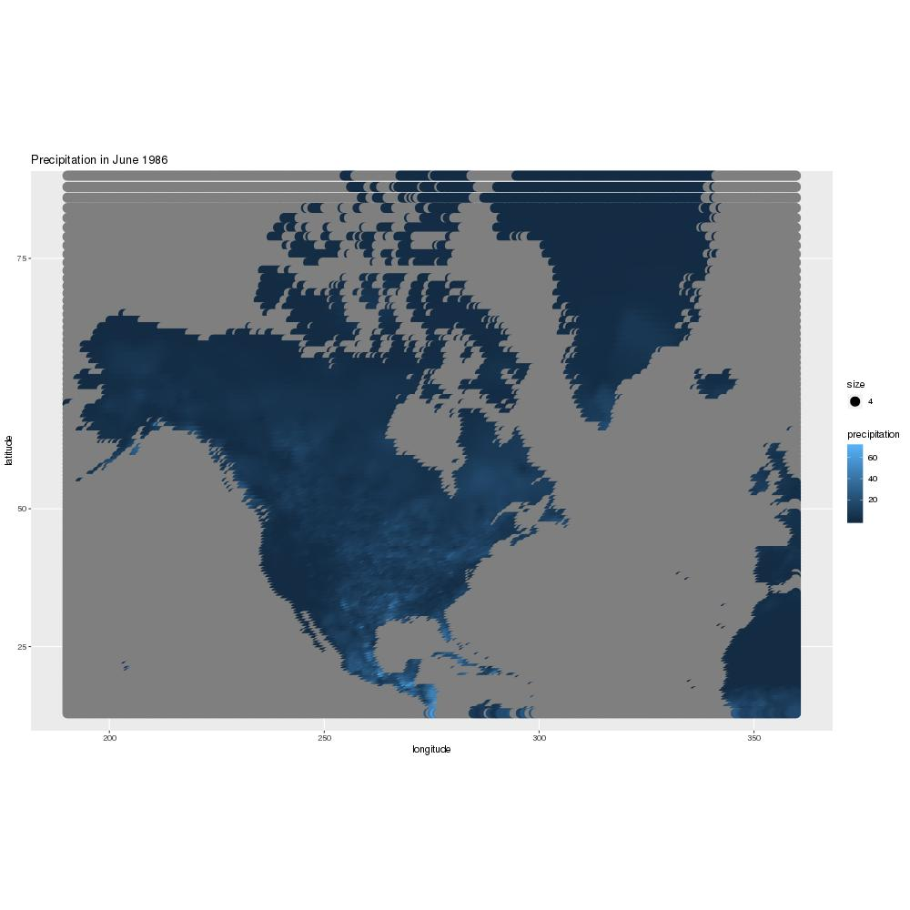

### Data

  The graphs below show the **Temperature** and **Precipitation** of _North America_ from the years 1960, 1986 and 2014. Through these graphs you can see how **Temperature** and **Precipitation** have changed over the years in _North America_. From these maps we can not make long term conclusions about temperature and precipitation, but only estimates about how these factors have changed over the years.   

### Temperature

  From the three graphs the Temperature patterns do look reasonable. There is a slight difference between the years. From 1960 to 2014 temperature has sligghtly decreased, mainly in the Northern United States. You can see this change on the map through the areas that have gotten darker over th years. 

### Precipitation

  From the three graphs the precipitaiton patterns do look reasonable. There is a major difference between the years. From 1960 to 2014 precipitation has increased, mainly in the Southern United States and in Southern North America. You can see this through the increase in lighter parts on the map.  

